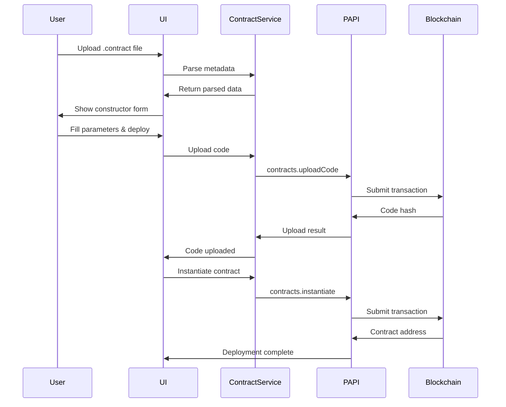
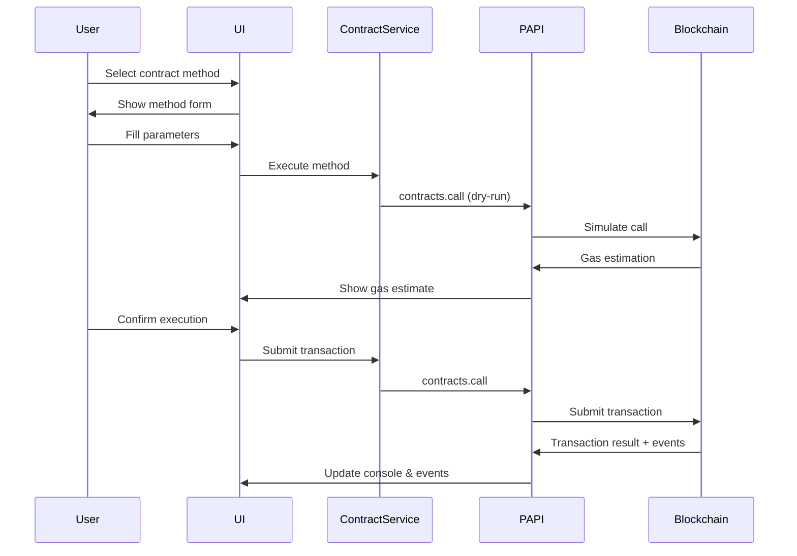

# PAPI Copy-Paste: Remix-Style ink! Smart Contract Integration Plan

## 🎯 Project Overview

This plan outlines the integration of Remix IDE-style functionality into the PAPI Copy-Paste tool, focusing on ink! v6 smart contract deployment, interaction, and management within the Polkadot ecosystem. The goal is to provide a comprehensive web-based interface for smart contract development workflows without requiring a code editor, leveraging the latest ink! v6 features and PolkaVM RISC-V execution engine.

### Key ink! v6 Features
- **PolkaVM RISC-V Execution**: New bytecode target for enhanced performance and lower gas costs
- **Enhanced Ethereum Compatibility**: Native Solidity ABI generation and MetaMask integration
- **Improved Type Safety**: Enhanced Rust-based type system with memory safety guarantees
- **Cross-Chain Interoperability**: Built-in support for Polkadot, Kusama, and parachain ecosystems

## 🏗️ Architecture Overview

### Current Foundation
- **Next.js 14** web application with responsive design
- **PAPI (Polkadot API)** integration for blockchain interaction
- **Multi-chain support** (Polkadot, Kusama, Moonbeam, etc.)
- **Educational features** with learning mode
- **Transaction queuing** and execution system
- **Code generation** with copy-paste functionality

### New Integration Points
- **ink! v6 Smart Contract Support** via Pop CLI and cargo-contract integration
- **PolkaVM Contract Execution** leveraging RISC-V bytecode execution
- **Contract Deployment Interface** extending existing transaction flows with two-phase deployment
- **Contract Interaction System** building on current pallet/call patterns with enhanced type safety
- **Real-time Event Monitoring** extending current console output system
- **Contract Storage Inspection** leveraging existing storage query capabilities
- **Ethereum Compatibility Layer** for Solidity ABI generation and MetaMask integration
- **E2E Testing Framework** integrated testing capabilities using ink_e2e

## 📋 Feature Scope & Specifications

### 🔥 **Phase 1: Core Contract Support (MVP)**

#### 1.1 Contract Deployment Interface
**Scope**: Enable users to deploy ink! v6 smart contracts through the web interface using two-phase deployment

**Components**:
- **Contract Upload Panel** (new center pane tab)
  - File upload for `.contract` files (PolkaVM RISC-V WASM + metadata)
  - Contract metadata parsing and validation (ink! v6 format)
  - Constructor parameter form generation with type safety
  - Gas limit estimation for PolkaVM execution
  - Endowment input with balance validation
  - Two-phase deploy process: Upload Code → Instantiate Contract
  - Progress tracking with detailed transaction status

- **Backend Services**:
  - `ContractService.ts`: Handle ink! v6 metadata parsing and PolkaVM WASM validation
  - `ContractDeployment.ts`: Manage two-phase deployment transactions
  - `MetadataParser.ts`: Extract constructor, methods, events, and type information
  - `GasEstimation.ts`: PolkaVM-specific gas estimation

**Pop CLI Integration**:
- Parse `.contract` files generated by `pop build` (ink! v6 with PolkaVM)
- Extract complete contract ABI with constructor, messages, events, and storage
- Handle deployment via `contracts.uploadCode` → `contracts.instantiate`
- Generate equivalent Pop CLI commands: `pop build` → `pop up --args <constructor_args>`

**Network Support**:
- Local development: ink-node or substrate-contracts-node
- Testnets: Paseo, Asset Hub Paseo
- Mainnets: Asset Hub Polkadot, Astar, Aleph Zero

#### 1.2 Contract Address Management
**Scope**: Manage deployed contract instances and load existing contracts

**Components**:
- **Contract Manager Component**
  - "At Address" input for existing contracts
  - Contract metadata upload/association
  - Pinned contracts list with local storage
  - Contract info display (address, code hash, balance)

- **Storage Integration**:
  - Local storage for pinned contracts
  - Contract metadata caching
  - Deployment history tracking

#### 1.3 Contract Method Execution
**Scope**: Interactive contract method calling interface with ink! v6 enhanced type safety

**Components**:
- **Contract Interaction Panel** (new center pane tab)
  - Method list with read/write separation and mutability indicators
  - Dynamic parameter forms based on ink! v6 method signatures
  - PolkaVM gas estimation for transaction methods
  - Value input for payable methods with balance validation
  - Execute/Query buttons with result display and type information
  - Real-time parameter validation using ink! type system

- **Backend Integration**:
  - Method signature parsing from ink! v6 contract metadata
  - Dry-run execution for read-only queries using `contracts.call` (dry-run: true)
  - Transaction building for state-changing calls via `contracts.call`
  - Result parsing with ink! v6 type-safe decoding and error handling
  - Support for complex types: Vecs, Maps, custom structs, enums

**Method Types Supported**:
- **Queries**: Read-only methods with dry-run execution
- **Transactions**: State-changing methods requiring gas and fees
- **Constructors**: Contract instantiation with parameter validation
- **Payable Methods**: Methods accepting token transfers

### ⚡ **Phase 2: Enhanced Interaction & Monitoring**

#### 2.1 Contract Event System
**Scope**: Real-time contract event monitoring and historical logs

**Components**:
- **Event Monitor Panel** (new right pane tab)
  - Real-time event subscription and display
  - Event filtering by contract and topic
  - Historical event querying
  - Event details with decoded parameters

- **Backend Services**:
  - `EventService.ts`: Event subscription management
  - Event decoding using contract metadata
  - Event persistence for history

#### 2.2 Contract Storage Inspection
**Scope**: View and monitor contract storage state

**Components**:
- **Storage Explorer Panel**
  - Contract storage key enumeration
  - Raw storage data decoding
  - Type-safe value display
  - Storage state change monitoring

- **Integration**:
  - Extend existing storage query system
  - Contract-specific storage key handling
  - Real-time storage updates

#### 2.3 Transaction History & Analysis
**Scope**: Track and analyze contract interactions

**Components**:
- **Transaction History Panel**
  - Contract transaction timeline
  - Gas usage analysis
  - Success/failure tracking
  - Transaction replay functionality

### 📊 **Phase 3: Advanced Features**

#### 3.1 Contract Testing Framework (ink_e2e Integration)
**Scope**: Automated E2E testing capabilities for deployed contracts using ink! v6 testing framework

**Components**:
- **E2E Test Scenario Builder**
  - Multi-step test creation using ink_e2e patterns
  - Mock account management with multiple test accounts
  - Assertion framework with contract state validation
  - Test execution and reporting with detailed results
  - Cross-contract testing support for complex scenarios

- **Testing Infrastructure**:
  - Integration with substrate-contracts-node for testing
  - Automated node spawning for isolated test environments
  - Test state management and cleanup
  - Integration with Pop CLI testing: `pop test --e2e`

**Test Types Supported**:
- **Unit Tests**: Individual method testing with mocked environments
- **Integration Tests**: Multi-contract interaction testing
- **E2E Tests**: Full blockchain environment testing with real nodes
- **Cross-Contract Tests**: Testing contract-to-contract interactions

#### 3.2 Multi-Contract Orchestration
**Scope**: Coordinate complex multi-contract operations

**Components**:
- **Contract Orchestration Panel**
  - Contract dependency mapping
  - Batch transaction building
  - Cross-contract call composition

## 🔄 User Flows

### Flow 1: Deploy New Contract
```
1. User selects "Contracts" tab in center pane
2. User clicks "Deploy New Contract" button
3. User uploads .contract file (generated from Pop CLI)
4. System parses contract metadata and shows constructor form
5. User fills constructor parameters and sets gas/endowment
6. User clicks "Deploy" → Transaction submitted
7. System monitors deployment and shows contract address
8. Contract automatically added to "My Contracts" list
9. User can immediately interact with deployed contract
```

### Flow 2: Interact with Existing Contract
```
1. User enters contract address in "At Address" field
2. User uploads contract metadata (.json file)
3. System validates contract exists and loads ABI
4. Contract appears in interaction panel with available methods
5. User selects method (e.g., "get_balance")
6. User fills required parameters
7. User clicks "Query" → Dry-run executed, result displayed
8. For state-changing calls, user clicks "Execute" → Transaction submitted
9. Result and events displayed in real-time
```

### Flow 3: Monitor Contract Activity
```
1. User selects contract from "My Contracts" list
2. User switches to "Events" tab in right pane
3. System subscribes to contract events in real-time
4. User sees live event stream as contract interactions occur
5. User can filter events by type or search historical events
6. User clicks on event to see decoded parameters
7. User can link events to specific transactions
```

### Flow 4: Test Contract Functionality
```
1. User opens contract in interaction panel
2. User switches to "Testing" mode
3. User creates test scenario with multiple accounts
4. User defines sequence of contract calls
5. User sets up assertions for expected outcomes
6. User runs test → System executes calls sequentially
7. System reports test results with pass/fail status
8. User can save and replay test scenarios
```

### Flow 5: Analyze Contract Storage
```
1. User selects contract from list
2. User opens "Storage" tab
3. System enumerates contract storage keys
4. User sees key-value pairs with type information
5. User can refresh to see real-time changes
6. User can export storage state
7. User can compare storage states across time
```

### Flow 6: Batch Contract Operations
```
1. User opens "Orchestration" panel
2. User adds multiple contracts to operation
3. User defines sequence of cross-contract calls
4. User sets up dependencies and conditions
5. User previews execution plan
6. User submits batch → System executes sequentially
7. User monitors progress with detailed feedback
```

## 🛠️ Technical Implementation Plan

### Phase 1 Implementation (4-6 weeks)

#### Week 1-2: Foundation
- **Contract Service Architecture**
  - Create `services/contractService.ts`
  - Implement contract metadata parsing
  - Add contract deployment functionality
  - Create contract storage utilities

- **UI Components**
  - Create `ContractDeployPanel` component
  - Create `ContractManager` component
  - Add contract deployment form
  - Implement file upload handling

#### Week 3-4: Contract Interaction
- **Method Execution System**
  - Create `ContractInteractionPanel` component
  - Implement method signature parsing
  - Add dynamic form generation
  - Create dry-run execution for queries

- **Transaction Integration**
  - Extend existing transaction system
  - Add contract call transaction building
  - Implement gas estimation for contracts
  - Add contract-specific error handling

#### Week 5-6: Polish & Integration
- **Code Generation Extension**
  - Add contract deployment code generation
  - Create contract interaction code templates
  - Extend existing copy-paste functionality
  - Add Pop CLI command generation

### Phase 2 Implementation (4-5 weeks)

#### Week 7-8: Event System
- **Event Monitoring**
  - Create `EventService.ts`
  - Implement event subscription
  - Add event decoding
  - Create event history storage

#### Week 9-10: Storage & History
- **Storage Inspector**
  - Create contract storage enumeration
  - Implement storage decoding
  - Add storage change monitoring
  - Create storage export functionality

#### Week 11: Transaction Analysis
- **History & Analytics**
  - Create transaction history tracking
  - Add gas usage analysis
  - Implement transaction replay
  - Create performance metrics

### Phase 3 Implementation (3-4 weeks)

#### Week 12-13: Testing Framework
- **Contract Testing**
  - Create test scenario builder
  - Implement mock account system
  - Add assertion framework
  - Create test execution engine

#### Week 14-15: Advanced Features
- **Multi-Contract Operations**
  - Create orchestration interface
  - Implement batch operations
  - Add dependency management
  - Create advanced analytics

## 🔧 Pop CLI Integration Strategy

### Direct Integration Points

#### 1. Contract Artifact Consumption (ink! v6 + PolkaVM)
- **Input**: `.contract` files from `pop build` (containing PolkaVM RISC-V WASM + ink! v6 metadata)
- **Processing**: Parse WASM + metadata bundle with enhanced type information
- **Output**: Deployment-ready contract data with full ABI extraction

#### 2. Command Generation & Code Templates
- **Generate Pop CLI Commands**: Create equivalent Pop CLI commands for all user operations
- **Examples**:
  ```bash
  # Project Creation (for reference)
  pop new contract my_contract

  # Building Contract
  pop build contract

  # Deployment (two-phase)
  pop up -p ./contract --constructor new --args "false" --suri //Alice
  pop up -p ./contract --constructor new --args "false" --use-wallet

  # Method Calls
  pop call contract --contract 0x123... --message get --suri //Alice
  pop call contract --contract 0x123... --message flip --suri //Alice -x

  # E2E Testing
  pop test contract --e2e
  ```

#### 3. Local Development Support
- **Integration**: Leverage Pop CLI's automatic local node spawning
- **Node Types**: substrate-contracts-node or ink-node
- **Benefit**: Automatic test environment setup without manual node management
- **Implementation**: Integration with Pop CLI node management for development environments

#### 4. Enhanced Template Support
- **ERC20 Template**: `pop new contract erc20 -c erc -t erc20`
- **Custom Templates**: Support for various contract templates via Pop CLI
- **Template Integration**: Parse and display available templates from Pop CLI

### Pop CLI Feature Mapping

| Pop CLI Feature | PAPI Tool Implementation | Integration Level |
|----------------|--------------------------|-------------------|
| `pop new contract` | Template showcase (reference only) | Display available templates |
| `pop build contract` | File upload expects build artifacts (.contract files) | Consume build outputs |
| `pop up` | Two-phase contract deployment interface | Full implementation |
| `pop call contract` | Contract interaction panel with method execution | Full implementation |
| `pop test --e2e` | E2E testing framework with UI runner | Integrated testing |
| Local node spawning | Development environment option with auto-setup | Node management |
| `--use-wallet` | Wallet integration for secure signing | Security enhancement |
| `--dry-run` | Query execution without state changes | Method execution |

## 🎓 Educational Integration

### Learning Mode Extensions

#### Contract Learning Paths (ink! v6 Focused)
- **Beginner**: ink! basics, PolkaVM execution, deployment, simple interactions
- **Intermediate**: Event handling, storage management, E2E testing with ink_e2e
- **Advanced**: Multi-contract systems, PolkaVM optimization, cross-chain contracts
- **Ethereum Migration**: Solidity to ink! migration patterns and compatibility

#### Interactive Tutorials
- **Deploy Your First ink! v6 Contract**: Step-by-step deployment with PolkaVM
- **Understanding Contract Events**: Real-time event exploration with type decoding
- **E2E Testing with ink_e2e**: Automated testing introduction using ink! testing framework
- **PolkaVM Gas Optimization**: Understanding and optimizing RISC-V execution costs
- **Cross-Chain Contracts**: XCM integration and parachain interactions
- **Ethereum Compatibility**: Using Solidity ABI generation for MetaMask integration

#### Code Template System
- **Contract Deployment**: Templates for ink! v6 two-phase deployment scenarios
- **Contract Interaction**: Examples for common interaction patterns with type safety
- **Event Handling**: Event subscription and processing with ink! v6 event system
- **E2E Testing**: Complete ink_e2e test templates with cross-contract scenarios
- **ERC20 Implementation**: Full ERC20 contract template using ink! v6 patterns
- **Ethereum Compatibility**: Templates for Solidity ABI generation and usage

## 📊 Success Metrics

### Phase 1 Goals (ink! v6 + PolkaVM)
- ✅ Successfully deploy ink! v6 contracts with PolkaVM execution via web interface
- ✅ Execute contract methods (both dry-run queries and on-chain transactions)
- ✅ Manage multiple contract instances with metadata persistence
- ✅ Generate deployable code snippets with Pop CLI command equivalents
- ✅ Two-phase deployment: upload code → instantiate contract
- ✅ Type-safe parameter validation using ink! v6 type system

### Phase 2 Goals (Enhanced Interaction)
- ✅ Real-time contract event monitoring with type-safe decoding
- ✅ Contract storage inspection and tracking with ink! storage keys
- ✅ Transaction history and PolkaVM gas analysis
- ✅ Comprehensive error handling with ink! error types
- ✅ Network support: Local, Paseo, Asset Hub, contract-enabled parachains

### Phase 3 Goals (Advanced Features & Testing)
- ✅ E2E testing framework using ink_e2e with automated node spawning
- ✅ Multi-contract orchestration with cross-contract calls
- ✅ PolkaVM performance optimization and gas analysis
- ✅ Ethereum compatibility with Solidity ABI generation
- ✅ Educational content for ink! v6 development patterns

## 🚫 Explicitly Out of Scope

### Code Editor Features
- ❌ ink! smart contract code editor
- ❌ Syntax highlighting for Rust/ink!
- ❌ Contract compilation pipeline
- ❌ IDE debugging with breakpoints

### Development Environment
- ❌ Integrated Pop CLI installation
- ❌ Rust toolchain management
- ❌ Contract template generation
- ❌ Version control integration

### Advanced IDE Features
- ❌ Code profiling and optimization
- ❌ Plugin system
- ❌ Team collaboration features
- ❌ Contract marketplace/discovery

## 🔮 Future Considerations

### Potential Extensions
- **EVM Contract Support**: Extend to Moonbeam/Astar EVM contracts with Solidity ABI bridge
- **Cross-Chain Contracts**: Support for XCM-enabled contract interactions across parachains
- **Contract Verification**: Integration with on-chain contract verification services
- **Community Features**: Contract sharing and collaboration with metadata registry
- **AI Code Assistant**: Natural language to ink! contract interaction
- **Mobile App**: Native mobile app for contract monitoring with wallet integration
- **PolkaVM Debugging**: Advanced debugging tools for RISC-V bytecode execution

### Integration Opportunities
- **Hardware Wallet Integration**: Ledger/Trezor support for secure contract operations
- **DApp Browser**: Embedded browser for ink! contract-based applications
- **Analytics Platform**: Advanced contract analytics with PolkaVM execution metrics
- **Multi-Sig Support**: Multi-signature contract operations with account abstraction
- **Inkathon Integration**: Integration with Inkathon boilerplate for full-stack dApp development
- **MetaMask Bridge**: Enhanced Ethereum compatibility with seamless MetaMask integration

---

## 📋 **Technical Specification Sheet**

### **Project Scope: Integration Approach**
**Decision**: Integrate smart contract features into existing PAPI Copy-Paste project rather than creating separate tool.

**Rationale**:
- 70% infrastructure reuse (chain connections, PAPI integration, UI patterns)
- Unified user journey from pallet interactions to smart contracts
- Market positioning as complete Polkadot development platform
- Economy of scale for maintenance and feature development

---

### **🏗️ Architecture Specification**

#### **Current Foundation (Reused)**
```typescript
// Existing Components - NO CHANGES REQUIRED
- useChainConnection()     // Reuse for contract-enabled chains
- useTransactionQueue()    // Extend for contract transactions
- useCodeGeneration()      // Extend for contract code generation
- useExecution()           // Extend for contract method execution
- Header                   // Add contract mode toggle
- LeftPane                 // Add contract/pallet toggle
- RightPane                // Extend console for contract events
```

#### **New Components (Contract-Specific)**
```typescript
// New Hooks
- useContractDeployment()  // Handle two-phase deployment
- useContractInteraction() // Method calls and queries
- useContractEvents()      // Real-time event monitoring
- useContractStorage()     // Contract storage inspection
- useContractTesting()     // E2E test execution

// New UI Components
- ContractUploadPanel      // File upload and metadata parsing
- ContractMethodPanel      // Method execution interface
- ContractEventMonitor     // Real-time event display
- ContractStorageExplorer  // Storage state viewer
- ContractTestRunner       // Testing interface

// New Services
- ContractService         // Core contract operations
- MetadataParser          // ink! v6 metadata parsing
- EventDecoder            // Contract event decoding
- GasEstimator           // PolkaVM gas estimation
```

---

### **🎯 Feature Integration Matrix**

| **Existing Feature** | **Contract Extension** | **Integration Method** |
|---------------------|----------------------|----------------------|
| **Chain Connection** | Contract-enabled chains | Extend existing hook with contract support |
| **Pallet Selection** | Contract selection | Add toggle: Pallets ↔ Contracts |
| **Call Forms** | Contract method forms | Reuse form patterns with contract metadata |
| **Transaction Queue** | Contract call queue | Extend existing queue with contract calls |
| **Code Generation** | Contract interaction code | Extend existing generator |
| **Execution Console** | Contract events/results | Extend existing console output |
| **Learning Mode** | ink! tutorials | Extend existing educational framework |

---

### **📱 User Interface Specification**

#### **Header Enhancements**
```typescript
interface HeaderProps {
  // Existing props...
  mode: 'pallets' | 'contracts'
  onModeChange: (mode: 'pallets' | 'contracts') => void
  learningMode: boolean
  onLearningToggle: () => void
}

// New header controls:
// [🏛️ Pallets] [📄 Contracts] [🎓 Learning] [🌐 Network] [👤 Account]
```

#### **Left Pane: Unified Navigation**
```typescript
interface LeftPaneProps {
  mode: 'pallets' | 'contracts'

  // Existing pallet props...
  pallets?: PalletInfo[]
  onCallSelect?: (pallet: string, call: any) => void
  onStorageSelect?: (pallet: string, storage: any) => void

  // New contract props...
  contracts?: ContractInfo[]
  onContractSelect?: (contract: ContractInfo) => void
  onContractUpload?: (file: File) => void
}

// Layout:
// Mode Toggle: [🏛️ Pallets] [📄 Contracts]
// Search: [🔍 Search pallets/contracts...]
// Content: Dynamic list based on mode
```

#### **Center Pane: Unified Forms**
```typescript
interface CenterPaneProps {
  mode: 'pallets' | 'contracts'

  // Existing pallet form props...
  selectedCall?: CallInfo
  selectedStorage?: StorageInfo

  // New contract form props...
  selectedContract?: ContractInfo
  deploymentMode?: 'upload' | 'instantiate' | 'interact'
  contractMethod?: MethodInfo
}

// Tabs:
// Pallets Mode: [📞 Calls] [💾 Storage] [📋 Queue]
// Contracts Mode: [🚀 Deploy] [🔧 Interact] [🧪 Test] [📋 Queue]
```

#### **Right Pane: Enhanced Output**
```typescript
interface RightPaneProps {
  // Existing props...
  code: string
  consoleOutput: string[]
  activeTab: 'code' | 'console' | 'events' | 'storage'

  // New contract props...
  contractEvents?: ContractEvent[]
  contractStorage?: StorageEntry[]
  testResults?: TestResult[]
}

// Tabs:
// [📝 Code] [🖥️ Console] [📡 Events] [💾 Storage] [🧪 Tests]
```

---

### **🔧 Technical Implementation Specification**

#### **Phase 1: Foundation (Weeks 1-4)**

##### **Week 1-2: Core Infrastructure**
```typescript
// 1. Extend Chain Configuration
interface ChainConfig {
  // Existing properties...
  contractsEnabled: boolean
  contractsPallet: 'contracts' | 'revive'
  testnet?: string
  faucet?: string
}

// 2. Contract Service Architecture
class ContractService {
  async parseMetadata(contractFile: File): Promise<ContractMetadata>
  async uploadCode(wasm: Uint8Array, metadata: any): Promise<CodeHash>
  async instantiate(codeHash: string, constructor: string, args: any[]): Promise<ContractAddress>
  async call(address: string, method: string, args: any[], options: CallOptions): Promise<CallResult>
  async query(address: string, method: string, args: any[]): Promise<QueryResult>
}

// 3. Metadata Parser
interface ContractMetadata {
  contract: {
    name: string
    version: string
    authors: string[]
  }
  spec: {
    constructors: Constructor[]
    messages: Message[]
    events: Event[]
    storage: StorageLayout
  }
  types: TypeDefinition[]
}
```

##### **Week 3-4: UI Integration**
```typescript
// 1. Mode Management Hook
function useAppMode() {
  const [mode, setMode] = useState<'pallets' | 'contracts'>('pallets')
  const [contractsEnabled, setContractsEnabled] = useState(false)

  // Persist mode preference
  // Handle mode switching logic
  // Validate contract support for selected chain
}

// 2. Contract Upload Component
function ContractUploadPanel() {
  const [file, setFile] = useState<File | null>(null)
  const [metadata, setMetadata] = useState<ContractMetadata | null>(null)
  const [uploading, setUploading] = useState(false)

  // File upload handling
  // Metadata parsing and validation
  // Upload progress tracking
}
```

#### **Phase 2: Contract Interaction (Weeks 5-8)**

##### **Week 5-6: Deployment System**
```typescript
// 1. Two-Phase Deployment Hook
function useContractDeployment() {
  const [phase, setPhase] = useState<'idle' | 'uploading' | 'instantiating' | 'complete'>('idle')
  const [codeHash, setCodeHash] = useState<string | null>(null)
  const [contractAddress, setContractAddress] = useState<string | null>(null)

  const uploadCode = async (wasm: Uint8Array, metadata: any) => {
    setPhase('uploading')
    // Upload contract code
    setCodeHash(result.codeHash)
    setPhase('instantiating')
  }

  const instantiateContract = async (constructor: string, args: any[]) => {
    // Create contract instance
    setContractAddress(result.address)
    setPhase('complete')
  }
}

// 2. Contract Method Interface
interface ContractMethodPanel {
  contract: ContractInfo
  metadata: ContractMetadata
  onMethodCall: (method: string, args: any[], options: CallOptions) => void
  onQuery: (method: string, args: any[]) => void
}
```

##### **Week 7-8: Event & Storage Systems**
```typescript
// 1. Event Monitoring Hook
function useContractEvents(contractAddress?: string) {
  const [events, setEvents] = useState<ContractEvent[]>([])
  const [subscription, setSubscription] = useState<any>(null)

  useEffect(() => {
    if (contractAddress) {
      // Subscribe to contract events
      // Decode events using metadata
      // Update events state
    }
  }, [contractAddress])
}

// 2. Storage Explorer Hook
function useContractStorage(contractAddress?: string) {
  const [storageEntries, setStorageEntries] = useState<StorageEntry[]>([])

  const refreshStorage = async () => {
    // Enumerate contract storage keys
    // Decode storage values
    // Update storage state
  }
}
```

#### **Phase 3: Advanced Features (Weeks 9-12)**

##### **Week 9-10: Testing Framework**
```typescript
// 1. E2E Test Runner
class ContractTestRunner {
  async spawnTestNode(): Promise<TestNode>
  async deployTestContracts(contracts: ContractInfo[]): Promise<DeployedContract[]>
  async runTestScenario(scenario: TestScenario): Promise<TestResult>
  async cleanup(): Promise<void>
}

// 2. Test Scenario Builder
interface TestScenario {
  name: string
  setup: TestStep[]
  actions: TestStep[]
  assertions: Assertion[]
  cleanup?: TestStep[]
}
```

##### **Week 11-12: Code Generation & Education**
```typescript
// 1. Enhanced Code Generation
function generateContractCode(
  contract: ContractInfo,
  method: string,
  args: any[],
  options: CodeGenOptions
): GeneratedCode {
  return {
    papi: generatePAPICode(contract, method, args),
    popCli: generatePopCliCommands(contract, method, args),
    frontend: generateFrontendCode(contract, method, args),
    tests: generateTestCode(contract, method, args)
  }
}

// 2. Learning Integration
interface ContractLearningPath {
  title: string
  steps: LearningStep[]
  prerequisites: string[]
  outcomes: string[]
}
```

---

### **📊 Data Flow Specification**

#### **Contract Deployment Flow**


#### **Contract Interaction Flow**


---

### **🔒 Security & Validation Specification**

#### **Input Validation**
```typescript
// 1. Contract File Validation
interface ContractFileValidator {
  validateFormat(file: File): ValidationResult
  validateMetadata(metadata: any): ValidationResult
  validateWASM(wasm: Uint8Array): ValidationResult
  checkVersion(version: string): ValidationResult
}

// 2. Parameter Validation
interface ParameterValidator {
  validateType(value: any, expectedType: TypeInfo): ValidationResult
  validateRange(value: number, min?: number, max?: number): ValidationResult
  validateAddress(address: string): ValidationResult
  validateBalance(amount: string, available: string): ValidationResult
}
```

#### **Error Handling**
```typescript
// 1. Contract Error Types
type ContractError =
  | { type: 'MetadataParseError', message: string }
  | { type: 'DeploymentError', phase: 'upload' | 'instantiate', message: string }
  | { type: 'ExecutionError', method: string, error: string }
  | { type: 'NetworkError', message: string }

// 2. Error Recovery
interface ErrorRecovery {
  retryableErrors: string[]
  maxRetries: number
  backoffStrategy: 'linear' | 'exponential'
  fallbackActions: FallbackAction[]
}
```

---

### **⚡ Performance Specification**

#### **Optimization Targets**
```typescript
interface PerformanceTargets {
  // File Operations
  metadataParsing: '< 100ms'
  contractUpload: '< 5s'

  // UI Responsiveness
  modeSwitch: '< 50ms'
  formValidation: '< 100ms'
  codeGeneration: '< 200ms'

  // Blockchain Operations
  gasEstimation: '< 2s'
  queryExecution: '< 1s'
  eventDecoding: '< 50ms'

  // Memory Usage
  metadataCache: '< 10MB'
  eventHistory: '< 5MB'
  contractStorage: '< 2MB'
}
```

#### **Caching Strategy**
```typescript
// 1. Multi-Level Caching
interface CacheStrategy {
  metadata: {
    storage: 'localStorage'
    ttl: '24h'
    maxSize: '10MB'
  }
  events: {
    storage: 'sessionStorage'
    ttl: '1h'
    maxEntries: 1000
  }
  gasEstimates: {
    storage: 'memory'
    ttl: '5m'
    maxEntries: 100
  }
}
```

---

### **📈 Success Metrics & KPIs**

#### **Technical Metrics**
```yaml
Performance:
  - Page load time: < 2s
  - Contract deployment: < 30s end-to-end
  - Method execution: < 5s average
  - Event processing: < 100ms latency

Reliability:
  - Uptime: > 99.5%
  - Transaction success rate: > 95%
  - Error recovery rate: > 90%
  - Data consistency: 100%

User Experience:
  - Time to first contract deployment: < 5 minutes
  - Learning completion rate: > 60%
  - Feature adoption rate: > 40% (existing users try contracts)
  - User retention: > 70% month-over-month
```

#### **Business Metrics**
```yaml
Adoption:
  - Monthly active users: 2x current within 6 months
  - Contract deployments: > 100/month within 3 months
  - Educational content completion: > 50% completion rate

Ecosystem Impact:
  - ink! developer onboarding: Reduce from weeks to days
  - Contract debugging time: 50% reduction
  - Community contributions: 10+ community-contributed tutorials
```

---

### **🚀 Deployment Strategy**

#### **Rollout Phases**
```yaml
Phase 1 - Alpha (Internal):
  - Core team testing
  - Basic functionality validation
  - Performance benchmarking
  - Duration: 2 weeks

Phase 2 - Beta (Limited):
  - 50 selected power users
  - Feature feedback collection
  - Bug fixing and optimization
  - Duration: 4 weeks

Phase 3 - Public Release:
  - Full feature rollout
  - Documentation completion
  - Community announcement
  - Educational content launch
```

#### **Feature Flags**
```typescript
interface FeatureFlags {
  contractMode: boolean           // Enable/disable entire contract mode
  contractDeployment: boolean     // Enable deployment features
  contractTesting: boolean        // Enable testing framework
  ethereumCompatibility: boolean  // Enable Solidity ABI features
  advancedAnalytics: boolean     // Enable advanced metrics
}
```

---

### **📚 Documentation Specification**

#### **Technical Documentation**
- **API Reference**: Complete PAPI contract integration docs
- **Architecture Guide**: System design and component interactions
- **Development Guide**: Setup, build, and contribution instructions
- **Deployment Guide**: Production deployment and configuration

#### **User Documentation**
- **Quick Start Guide**: 5-minute contract deployment tutorial
- **Feature Guides**: Comprehensive feature explanations
- **Learning Paths**: Structured educational content
- **Troubleshooting**: Common issues and solutions

#### **Educational Content**
- **Interactive Tutorials**: Hands-on learning experiences
- **Video Guides**: Step-by-step video tutorials
- **Code Examples**: Copy-paste ready examples
- **Best Practices**: Security and optimization guidelines

---

## 🏁 Next Steps

1. **Phase 1 Planning**: Create detailed technical specifications for core components
2. **UI/UX Design**: Design contract-focused interface extensions
3. **Pop CLI Testing**: Set up local development environment with Pop CLI
4. **Prototype Development**: Create basic contract deployment proof-of-concept
5. **Community Feedback**: Gather input from ink! developer community

This plan provides a comprehensive roadmap for transforming the PAPI Copy-Paste tool into a full-featured ink! smart contract development and interaction platform, leveraging the existing architecture while adding powerful new capabilities inspired by Remix IDE.